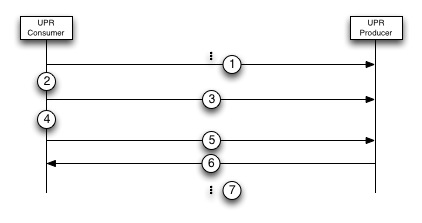

##Dead Connections (Ack/Nack)

This document is intended to describe how UPR Producers will deal with slow consumers and dead connections. Below we describe a basic algorithm for dealing with these situations. In the future we plan on making optimization to this design in order boost replication performance.

#####Slow Consumer

A consumer can become slow when it is overloaded with data to process. The most common reason for this happening is that the consumer has run out of memory to queue new requests. When this happens the consumer will respond to front-end requests (eg. gets and sets) with a Temporary Failure error code.

UPR Connections need a similar mechanism in order to make sure that replication can be throttled when a consumer is overloaded. The diagram below shows the message exchange that will take place when the consumer is overloaded.

This exchange assumes that an UPR connection already exists and that the connection contains a stream for a single VBucket. We look at a connection with a single VBucket in order to simplify the example.

1. Initially we have a healthy connection that contains one stream and the consumer is receiving mutations over that connection.
2. The consumer has become overloaded and it does not have memory that it can use to hold the incoming UPR mutations.
3. When the consumer receives the next UPR message it returns a response to the producer indicating a temporary failure. This is different behavior from the common case because the consumer will not send responses for incoming mutations. The stream on the consumer side will now sleep until there is sufficient memory to resume replication.
4. At some point the consumer will no longer be overloaded and will have sufficient memory to resume replication. The consumer will wake up the sleeping streams and tell them they can resume replication.
5. When a stream is woken up it checks its VBucket to see what the last item it received was. It will then send a stream request to the producer to resume its replication stream.
6. The producer will respond to the stream request from the consumer to tell the consumer that replication will start.
7. The consumer begins to receive items from the producer starting with where the consumer last left off.

#####Dead Connection Detection

Dead connections will be detected through the use of a no-op command which will be scheduled at a given interval. This operation will be sent on a connection basis as opposed to being sent for each stream. Upon receiving a no-op the consumer should immediately respond with a no-op response.