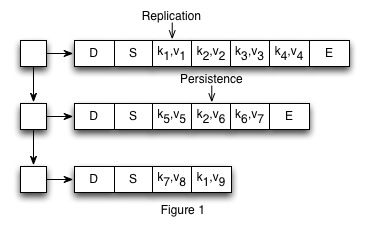
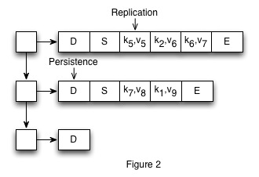
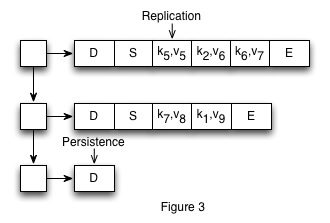
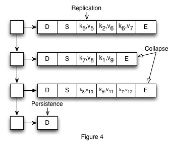
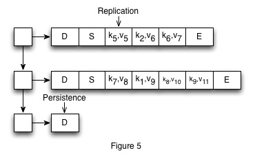

#Mutation Manager (3.x)

Couchbase 2.x currently provides replication through the ep-engine component by using the tap and checkpoint manager modules. The checkpoint manager is used in order to queue recent front-end operations for persistence and replication and the tap module provides connection management for replication streams. In Couchbase 3.x we are completely revamping the entire replication protocol which requires us to add a new way to manage queueing of front-end operations. The properties of this new manager, called the Mutation Manager, are described below.

The Mutation Manager will be implemented as a list of snapshots and can be traversed through the use of a Mutation Cursor. Each snapshot is guaranteed to contain a unique list of key-value pairs which are queued into the Mutation Manager. Figure 1 below shows an example of what the state of items queued into the Mutation Manager might look like. Each snapshot in the manager will always start with a Dummy item and a Start Snapshot item. The dummy item is simply added so that a Mutation Cursor can be at the front of a snapshot without having sent anything from that snapshot. Dummy items will be skipped by Mutation Cursors and will never be seen by users of the Mutation Manager. The Start Snapshot item signifies the beginning of a new snapshot and is passed back to the caller though the Mutation Cursor

Mutations can be read out of the Mutation Manager through the use of a Mutation Cursor which will follow the iterator pattern. Mutation Cursors are created and then registered into the Mutation Manager and the items are then retrieved by calling the next() and hasNext() functions. Mutation Cursors are shown in Figure 1 under the names "replication" and "persistence".

One important property of the Mutation Manager is that the most recent snapshot, called the open snapshot, will not be closed until the a Mutation Cursor is inserted into it. This allows this snapshot to deduplicate recently queued items with the same key. Figure 2 shows the Mutation Mangers state some time after the state shown in Figure 1. You will notice that no more front-end items have been queued into the Mutation Manager and that the persistence and replication cursors have each moved to the next snapshot. When the persistence cursor moves into the open snapshot that snapshot is immidiately closed and a new open snapshot is created in its place to accept future mutations. Note that the new snapshot that was created does not contain a Start Snapshot message. This message is added only when a mutation is actually put into the open snapshot.

Another thing to notice is that the snapshot that the replication cursor was traversing in Figure 1 is no longer present in Figure 2. This is because we only keep around snapshots that that need to be traversed by Mutation Cursors currently in the Mutation Manager. As soon as a snapshot is no longer needed we remove it in order to keep memory pressure as low as possible.

At some point the persistence cursor will reach the end of the Mutation Manager as shown in Figure 3. Since no more items have been inserted the persistence cursor is considered fully up to date and is sitting in the open snapshot, but it has no items left to send. When cursors are in the open snapshot and no items exist in the open snapshot then the Mutation Cursor will wait until an item is added. Once a new item is queued into the Mutation Manager then a snapshot will be created immediately and all cursors that were in the open snapshot will begin iterating that snapshot. A new open snapshot will also be add for any future items queued.

Some time later new items are added and the persistence cursor is able to persist all of the items in the Mutation Manager, but the replication cursor has not made any progress. As a result the are two consecutive snapshots that do not contain cursors, but they are not at the end of the snapshot list so we cannot just remove them. One of the goals of the Mutation Manager however is to make snapshots as large as possible and also to de-duplicate similar items as frequently as possible. In order to help achieve this goal the Mutation Manager will collapse consecutive checkpoints and de-duplicate similar items between the checkpoints whenever possible. The inital state of the Mutation Manager before de-duplication is shown in Figure 4 and the state of the Mutation Manager after de-duplication is shown in Figure 5.

Snapshot collapsing will always be attempted when a Mutation Cursor moves between snapshots. The cursor will attempt to lock both previous snapshots in order to prevent other cursors from entering them and if successful the cursor will collapse the snapshots.

The above examples describe the key features of the Mutation Manager data structure. One thing that is important to ease use of the Mutation Manager is to hide all of the details of its implementation to the processes that are actually iterating it. As a result the iteration will take place simply by creating a Mutation Cursor and attaching the cursor to the Mutation Manager. All the process using the cursor should know is that is calls next() to get the next piece of data. More details will be provided on this interaction in a future lower level document.