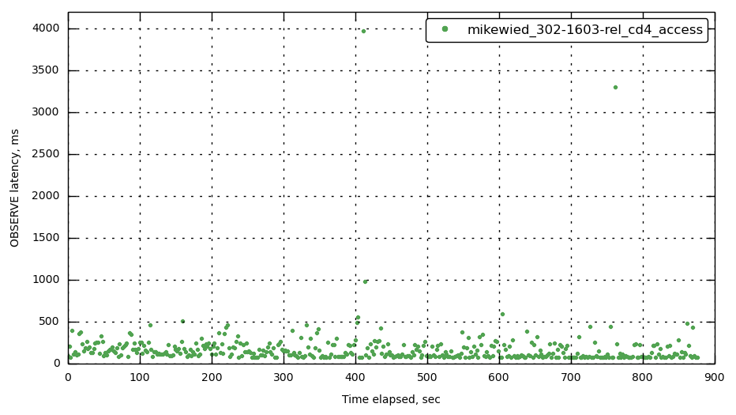
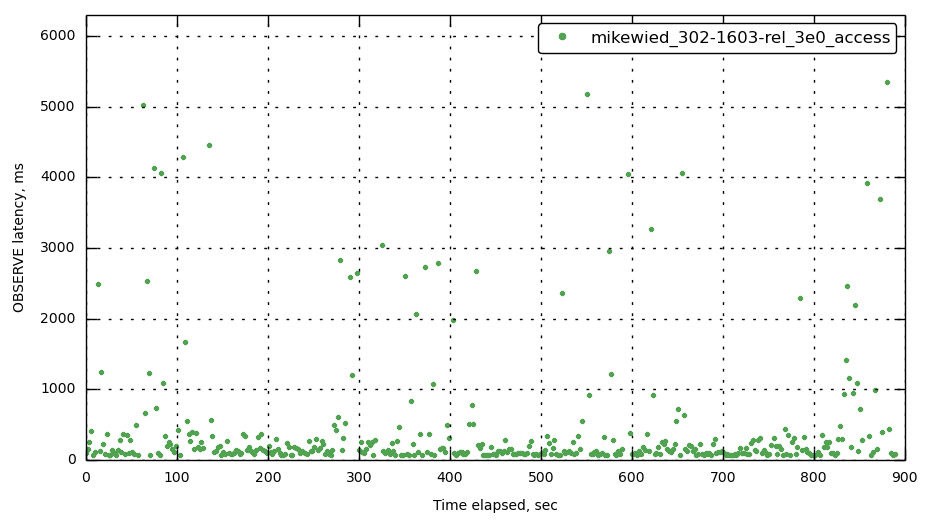

#DCP Performance Analysis

##Test Scenarios

* All tests were run on Centos 6 VMs
* Builds used: 3.0.2-1644 and 4.0.0-1655 (sherlock)
* Tests were run for couchbase server on **4 Core** and **8 core** machines with **4GB** and **8GB** RAM
* Tests were run with 100% resident ratio and with DGM (about 50% resident ratio)
* Nodes: 2; Replica count: 1
* Load: Total incoming mutations on all nodes
* Items and size: 1,000,000 items in non DGM case and 2,500,000 in DGM case. Item size: 1KB.
* Replication, replication with views, replication with xdcr, replication with xdcr and views and with multiple number of external clients tested with front end load
*Note: XDCR tests were not run on sherlock build*

##Performance Indicators
### Replication Latency
Replication latency is measured as the time taken for an item update to appear at the replica node. This is sampled across a subset of items that are updated by the front end load. 80th, 95th, 99th percentiles of the latencies are captured. A latency within **0.5s for 95th percentile** and **1s for 99th percentile** is considered **good enough**.
        
### Replication Items Queue Size
Number of items in the replication queue. This is got by polling EP Engine stats which indicates the items that are yet to be replicated at that instance. The average size of the queue and the max observed queue sizes are captured. Spikes in the queue size indicated that replication is suffering (since our test case only has a steady load with no rebalance or failover). 

### Rate of Replication Bytes Sent
Rate at which replication bytes are sent over the network is captured and is measured as bytes per second. This is got by polling EP Engine stats. Average, maximum and minimum of these sampled rates were captured. Fall in the replication rates, with instances of 0 bytes/sec is not considered good for replication.

##Conclusions

###Baseline Tests
* **Replication only:** Replication latencies good until 12k load
* **Replication with views:** Replication latencies good until 11k load
* **Replication with xdcr:** Replication latencies good until 8k load on 8core 8GB VM
* **Replication with xdcr and views:** Replication latencies good until 6k load

                                **Good replication latency**

                                **High replication latency**

In each scenario after a certain front end load, we see spikes in replication queue sizes and the replication latencies even though the CPU usage is not close to 100%. We suspect the reason for this is due to **increased memory usage due to backfill** in 3.0.2 and  the **backfill buffer becoming full** in sherlock. The backfill buffer is currently a fixed value irrespective of the bucket size and backfilling of items is suspended until the buffer is drained.

**View** is equivalent to an additional external connection. But, in general, this will cause more backfilling due to various snapshot requests.

**XDCR** is equivalent to 8 external connections in 3.0.2. Unlike replication, DCP streams open and close continuously in XDCR contributing to continuous backfilling requests.

Both Views and XDCR contribute to increased memory usage and also contend with the replication thread for the CPU, thereby increasing the replication latencies.

###Effect of external clients
* **Initial Replication Queue Size build-up:** In 3.0.2 backfilling is done directly onto memory. With the increase in the number of external clients **beyond 5 connections**, the memory used by backfills increase unboundedly. Hence the replication suffers initially until we reach a steady state. The time taken to reach the steady state increases with the increase in the number of connections. This problem is not seen in sherlock because we have a backfill buffer per connection and the memory usage by the backfills is bound by this.
* **Steady state:** When compared to the baseline replication only case, increase is seen in the replication latencies and replication queue sizes. This is due to increased CPU activity and reduced amount of scheduling of the replication thread.
* **Effect on front end load:**

###4 core vs 8 core
* Results with 8 cores is better but similar behaviour characteristics
* In general, if we solve the problem of memory used up by backfills in 3.0.2 and set appropriate size to backfill buffers in sherlock, with more cores we can support more load with good enough replication latencies.

###4GB RAM vs 8GB RAM
* With 8GB RAM we can have relatively more external clients before we see the initial replica queue build up due to backfill. We **did not see initial replica queue build up upto to 10 clients**.

###DGM vs Non DGM
* Similar results with baseline tests
* DGM in 3.0.2 having more ext clients leads **initial replica queue build** up due to backfill. This is **seen with just 5 external clients**.

##3.0.2 vs Sherlock
* No initial replica queue build up due to backfills. Because in sherlock we have a backfill buffer per connection and the memory usage by the backfills is bound by this.

##Further Improvements
### Variable backfill buffer size
Set backfill buffer size as a percentage of the bucket memory size. With we can backfill more items and This helps improve the replication latency in nodes with higher memory.

### Connection Prioritization
We need a way to specify that certain DCP connections should be visited and receive a higher priority than other connections. This will allow us to make sure replication is always getting the most attention, followed by xdcr and indexing, followed by backup/restore and other integration plugins.

### Slow Connection Detection (Cursor dropping)
We need to be able to deal with connections that do not read data quickly. Since we don't allow items in an in-memory checkpoint to be purged from memory if a cursor is registered a slow connection can cause high memory overhead in the server. One proposal for this is to drop the cursor from memory and close the stream forcing the client to reconnect the stream once it is ready to receive more items. 

##All test results
* [3.0.2 results](3.0.2/overview.md)
* [4.0.0 results](4.0.0/overview.md)