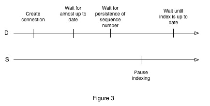

#VBucket Move (3.x)

This document intends to provide a detailed step by step description of the messages and commands that will be used to move a VBucket from one node to another using the UPR protocol. A VBucket move consists if an initial connection handshake, VBucket filter changes, getting the new VBucket up to date with respect to the old VBucket, and the actual VBucket takeover. Each of these phases will be detailed in the sections below.

###Initial Connection Handshake

(1) The EBucketMigrator sends a "Create Connection" message to the UPR Consumer. This message will contain a list of vbuckets that the consumer should ask the producer side for as well as a name for the stream. This name will be used when initialing the stream with the producer.

(2) The consumer side will send out a start stream message for each vbucket that it wants to receive. Each message will contain a high sequence number/vbucket uuid pair that tells the producer where the consumer last left off in the data stream. These messages will be sent directly back to the ebucketmigrator process and should be forwarded to the producer side of the connection.

The producer will respond to each start stream request with either an ok message or a rollback message. If the message is rollback then the stream behavior will resume at step 3, but if an ok message is received then jump to step 5.

(3) Based on the high sequence number/vbucket uuid pair that was sent in the stream start message the producer has decided that the consumer must rollback it's data to a specific sequence number. The producer will signal to the consumer that this needs to be done by sending a rollback message that contains the sequence number that the consumer needs to roll back to.

(4) When the consumer receives a rollback message it will rollback to at least the sequence number specified by the producer. The consumer will then send a new start stream message back to the producer with it's updated state.

It is possible if there is a failover between steps 3 and 4 that the consumer will need to rollback again. This should be rare, but if it does happen then jump back to step 3.

(5) Since the consumer has rolled back its state to be in sync with the producer the consumer will receive an ok message which will contain the failover log of the producer. The consumer should persist and overwrite its failover log with the one from the producer.

At this point the request-response pattern for a stream will change. During the handshake the consumer made all requests, but post-handshake the producer will make requests.

(6) The producer will send a start stream message to the consumer to let the consumer know that it will begin receiving data. Unless an explicit ack message is required or if the consumer is overloaded the consumer will not send a response for messages sent by the producer. This behavior will continue until the stream is completed.

###VBucket Filter Changing

I will fill in this section with more details soon, but I still want to discuss some of this stuff with Trond. My current proposal is to have an "Add Vbuckets to Stream Command" which would be used similarly to the current "Change Vbucket Command". The only difference is that you can't close VBucket Streams with this command. This command would only be used on the consumer side of the UPR connection since all streams must start on the consumer side.

The second command that would be added would be a "Close VBucket Stream Command" which would remove VBuckets from a stream. This could be used on either side of the connection.

I'll provide more updates here as I get more details finalized, but let me know if you have any thoughts.

###Moving Data

In order to bring the new VBucket up to date with respect to the current active VBucket we must monitor the UPR stream for certain events to take place. Figure 3 below shows each of these events and how they can be monitored will be described below.

(1) The first event that ns_server needs to see take place is for the new VBucket to be close to being up to date. NS_Server will be able to find out about this event by polling "stats vbucket-takeover <stream name>". This stat will provide an estimate of how much more data needs to be sent over the given stream. If there are less than 1000 items that still need to be sent the NS_Server can asuume that the new VBucket is almost up to date with respect to the old VBucket.

(2) NS_Server will then stop the indexer on the old VBucket and get the last sequence number that has been indexed by the indexer for the vbucket that is being moved.

(3) The EBucketMigrator will then monitor the UPR stream until it sees a message sent for the VBucket it is moving that contains a sequence number greater than or equal to the sequence number that was last indexed by the indexer. NS_Server will then poll the node that contains the new VBucket with the "stats high-seqno" command and wait until that sequence number is seen for the new VBucket.

(4) NS_Server will next poll the indexer on the node containing the new VBucket until it has seen that a sequence number that is greater than or equal to the last sequence number indexed on the old VBucket has been indexed on the new VBucket.

###VBucket Takeover

This is probably the most interesting part of the design for you and I am still trying to work out the details to see if we can do something better than we are currently doing. I will discuss this with others today, but please let me know if you have any proposals for this section so I can integrate you ideas into the design.